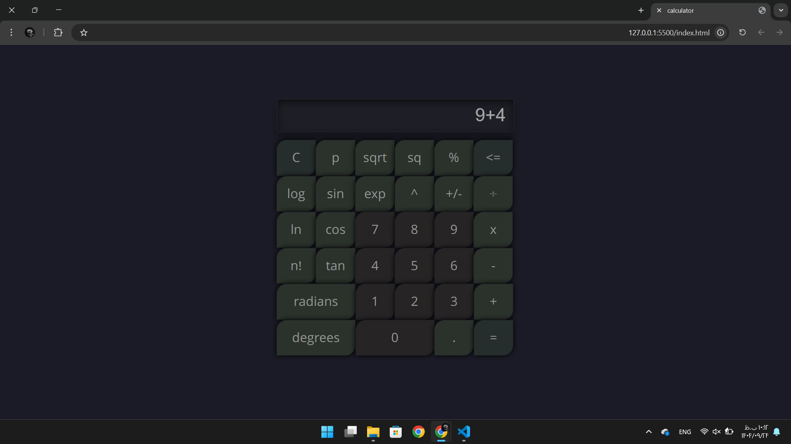

# 🧮 Professional Scientific Calculator

## 📌 About the Project

**scientific calculator** built beautifully and functionally with **pure HTML, CSS, and JavaScript** (no frameworks).  
Dark UI, responsive, with smooth visual effects.

---

## 📸 Preview

| Preview |
|---------|
|  | 

*(Actual calculator view in the browser)*

---

## ✨ Key Features

- Basic operations: `+`, `−`, `×`, `÷`  
- Scientific functions: `sin`, `cos`, `tan`, `log`, `ln`, `exp`, `√x`, `x²`, `x^y`, `n!`, `π`  
- Angle conversion: radians ↔ degrees  
- Utility tools: clear (`C`), delete last digit (`←`), toggle sign (`+/-`), percentage (`%`)  
- Error handling: `Syntax Error` and `Overload Error`  
- Modern design: Sahel font, hover/active effects, wide zero button  

---

## 🚀 How to Run

1. Download all files.  
2. Open `index.html` in your browser.  
3. Fully offline, no installation needed.

---

## 📂 Project Structure

```bash
project-root/
├── index.html        # Main page
├── calc.css          # Styling
├── main.js           # Calculator logic
├── fonts/
│   ├── Sahel.woff
│   └── Sahel.woff2
├── Screenshot/      # Folder containing screenshots
│   └── Screenshot.png  # Screenshot of calculator
└── README.md
```
---

##  💡 Suitable For

Student projects

Front-End portfolio

Personal use

Base for developing advanced calculators

---

##  🛠 Tech Stack

HTML5

CSS3 (Flexbox and interactive effects)

Vanilla JavaScript

---

## 👨‍💻 Author

Amir Nouaparast  
GitHub: [Amir Nouaparast](https://github.com/AmirNouaparast)  
Frontend Developer | React & Vanilla JS Enthusiast |  
Built with ❤️ for simplicity and elegance in codin